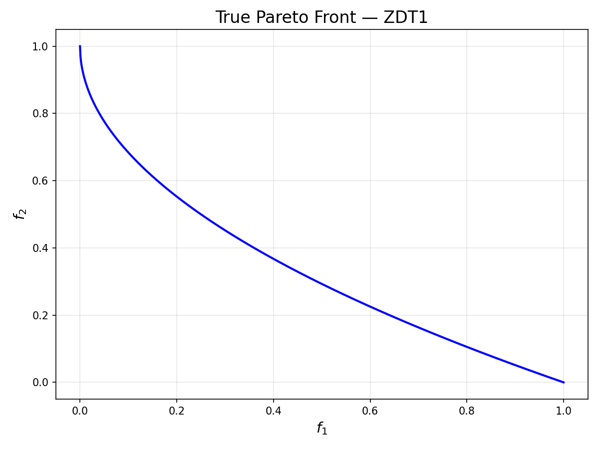
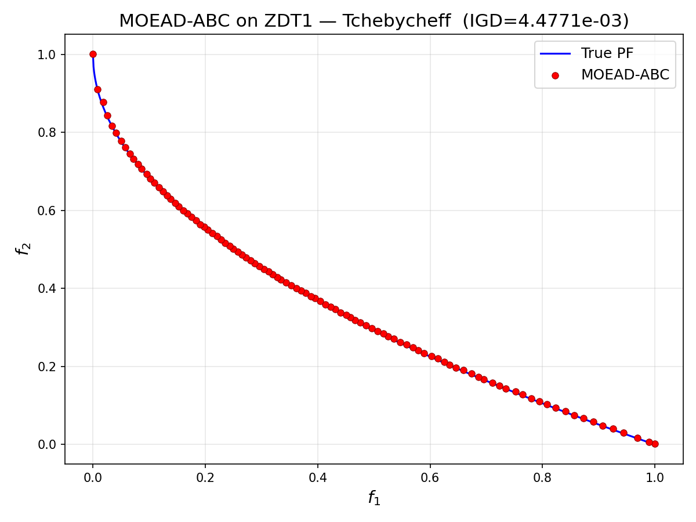
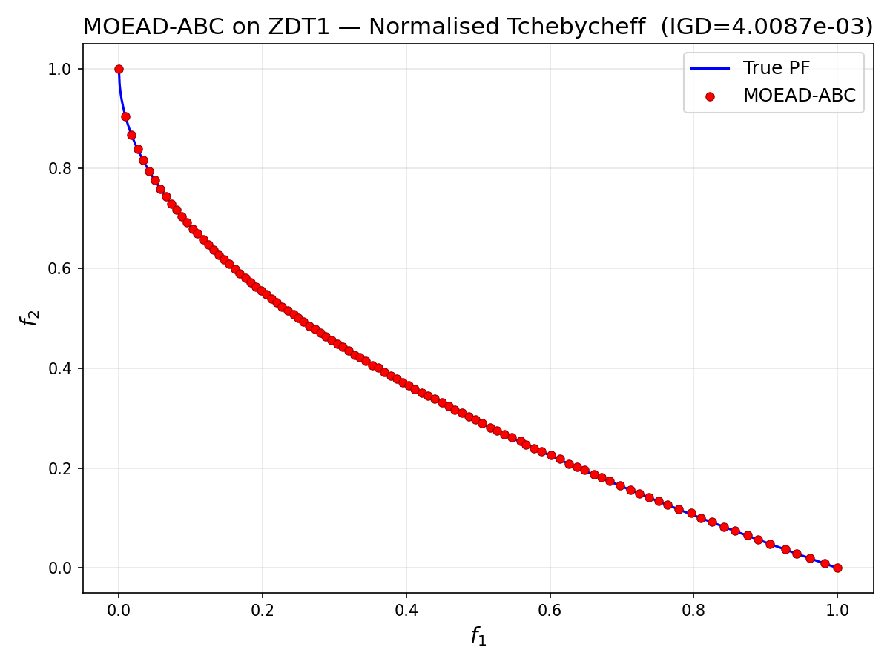
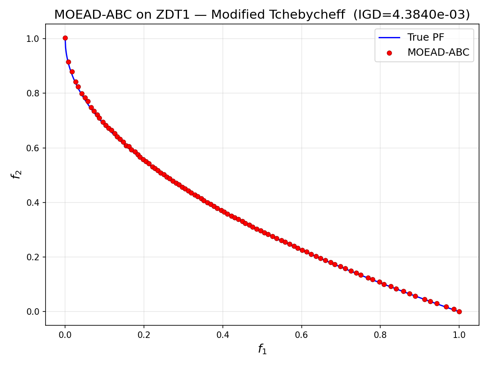
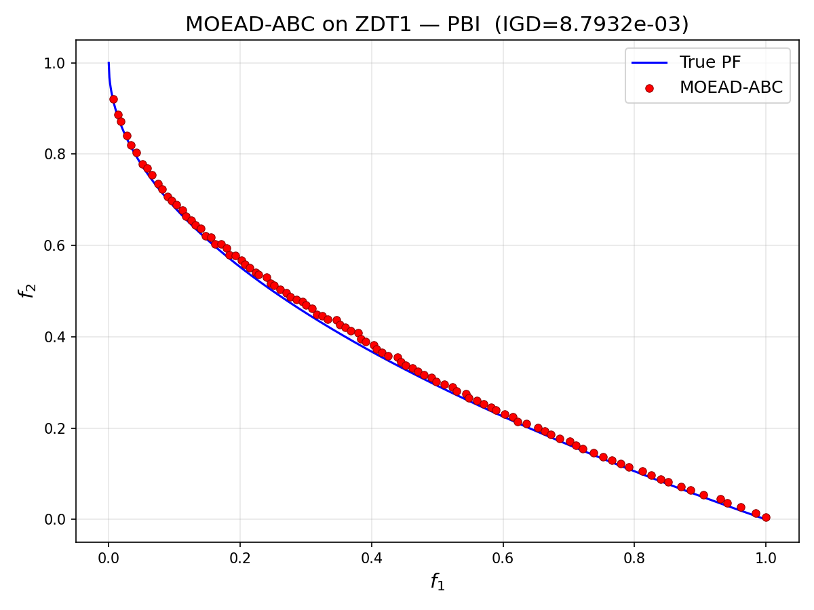
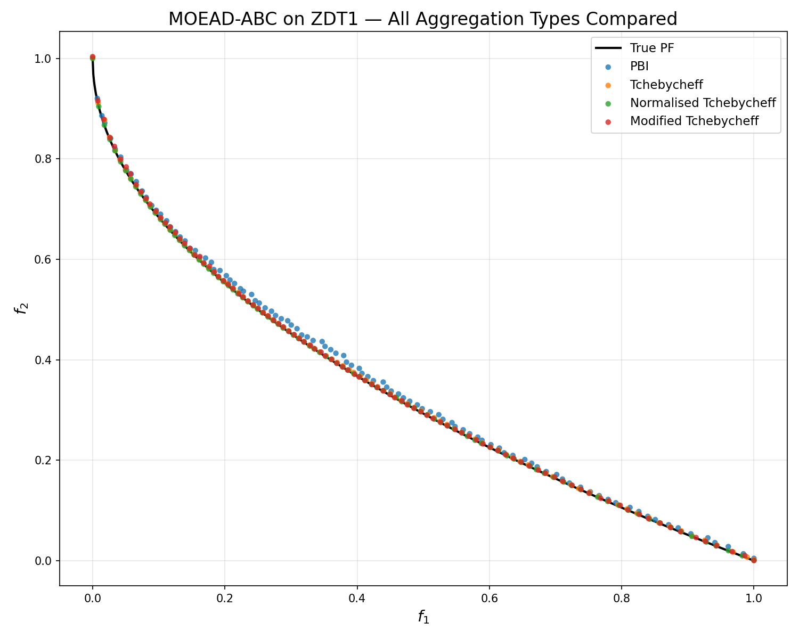

<div align="center">

# 🐝 MOEAD-ABC

### Multi-Objective Artificial Bee Colony Algorithm based on Decomposition

[](LICENSE)
[](python/)
[](matlab/)
[](https://www.scitepress.org/PublishedPapers/2019/)

*A decomposition-based multi-objective optimizer combining MOEA/D with Artificial Bee Colony search*

</div>

---

## Overview

**MOEAD-ABC** decomposes a multi-objective optimisation problem (MOP) into scalar sub-problems via uniformly distributed weight vectors, then applies an Artificial Bee Colony search within each sub-problem's neighbourhood. Supports normalised and scaled MOPs out of the box.

### Key Features

| Feature | Details |
|---|---|
| **Decomposition** | Uniform weight vectors (Das & Dennis, 1998) |
| **Search strategy** | ABC with fitness-proportionate roulette wheel selection |
| **Exploration** | Polynomial mutation |
| **Aggregation functions** | PBI · Tchebycheff · Normalised Tchebycheff · Modified Tchebycheff |
| **Scalability** | Two-layer weight generation for many-objective problems |

---

## Algorithm Overview

MOEAD-ABC integrates the **decomposition framework of MOEA/D** with the **swarm intelligence of the Artificial Bee Colony (ABC)** metaheuristic. The figure below illustrates the high-level workflow:

```
┌─────────────────────────────────────────────────────────────────────┐
│                        MOEAD-ABC Pipeline                           │
│                                                                     │
│  Initialise weight vectors ──► Build neighbourhoods                 │
│           │                                                         │
│           ▼                                                         │
│  Generate initial population  ──► Evaluate objectives              │
│           │                                                         │
│           ▼                                                         │
│  ┌─── Employed Bee Phase ────────────────────────────────────┐     │
│  │   For each sub-problem: generate & evaluate a new         │     │
│  │   solution via ABC operators (roulette + mutation)        │     │
│  └───────────────────────────────────────────────────────────┘     │
│           │                                                         │
│           ▼                                                         │
│  ┌─── Onlooker Bee Phase ────────────────────────────────────┐     │
│  │   Fitness-proportionate selection across neighbourhood;   │     │
│  │   update reference point & neighbours if improved        │     │
│  └───────────────────────────────────────────────────────────┘     │
│           │                                                         │
│           ▼                                                         │
│  ┌─── Scout Bee Phase ───────────────────────────────────────┐     │
│  │   Abandon stagnant sources; reinitialise randomly        │     │
│  └───────────────────────────────────────────────────────────┘     │
│           │                                                         │
│           ▼                                                         │
│  Max generations reached? ──No──► repeat                           │
│           │ Yes                                                     │
│           ▼                                                         │
│       Return Pareto front approximation                             │
└─────────────────────────────────────────────────────────────────────┘
```

---

## Results on ZDT1

All experiments below run on the **ZDT1** benchmark (2-objective, 30 variables). Results are saved under [`MOABC/results/`](MOABC/results/).

### True Pareto Front

<p align="center">
  
  <br><em>Figure 1 — True Pareto front of ZDT1</em>
</p>

---

### Aggregation Function Comparison

MOEAD-ABC is tested with four different aggregation (scalarisation) functions. Each panel shows the approximated Pareto front obtained after convergence.

<table align="center">
  <tr>
    <td align="center">
      <br>
      <sub><b>Tchebycheff</b></sub>
    </td>
    <td align="center">
      <br>
      <sub><b>Normalised Tchebycheff</b></sub>
    </td>
  </tr>
  <tr>
    <td align="center">
      <br>
      <sub><b>Modified Tchebycheff</b></sub>
    </td>
    <td align="center">
      <br>
      <sub><b>Penalty-Based Boundary Intersection (PBI)</b></sub>
    </td>
  </tr>
</table>

---

### All Aggregation Functions — Overlay

<p align="center">
  
  <br><em>Figure 2 — Pareto front approximations across all four aggregation functions on ZDT1</em>
</p>

---

## Implementations

Two independent, self-contained implementations — pick the one that fits your stack:

| Language | Directory | Requirements |
|---|---|---|
| 🐍 **Python** | [`python/`](python/) | Python 3.10+, NumPy, SciPy, Matplotlib |
| 🔢 **MATLAB** | [`matlab/`](matlab/) | MATLAB R2016b+ |

---

## Quick Start

### 🐍 Python

```bash
cd python
pip install -r requirements.txt
python main.py -algorithm moeadabc -problem zdt1 -N 100 -M 2
```

### 🔢 MATLAB

```matlab
cd matlab
main('-algorithm', @MOEADABC, '-problem', @ZDT1, '-N', 100, '-M', 2)
```

> See [python/README.md](python/README.md) and [matlab/README.md](matlab/README.md) for full parameter references.

---

## Repository Structure

```
MOABC/
├── python/
│   ├── main.py                # Entry point (CLI)
│   ├── moeadabc.py            # MOEAD-ABC algorithm
│   ├── global_config.py       # Experiment configuration
│   ├── individual.py          # Solution representation
│   ├── problem.py             # Problem base class
│   ├── zdt1.py                # ZDT1 benchmark
│   ├── uniform_point.py       # Weight vector generation
│   ├── roulette_wheel.py      # Roulette wheel selection
│   ├── igd.py                 # IGD performance metric
│   ├── draw.py                # Plotting utilities
│   └── requirements.txt
└── matlab/
    ├── main.m                 % Entry point
    ├── MOEADABC.m             % MOEAD-ABC algorithm
    ├── GLOBAL.m               % Experiment configuration
    ├── INDIVIDUAL.m           % Solution representation
    ├── PROBLEM.m              % Problem base class
    ├── ZDT1.m                 % ZDT1 benchmark
    ├── UniformPoint.m         % Weight vector generation
    ├── SelfRouletteWheelSelection.m
    ├── IGD.m                  % IGD performance metric
    └── Draw.m                 % Plotting utilities
```

---

## Reference

If you use this code, please cite:

> **A Multiobjective Artificial Bee Colony Algorithm based on Decomposition**
> *11th International Conference on Evolutionary Computation Theory and Applications (ECTA), 2019.*

---

## License

Released under the [MIT License](LICENSE).
